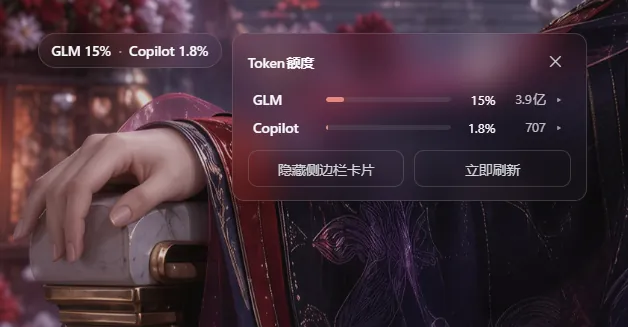
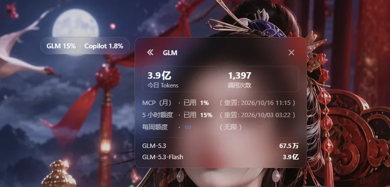
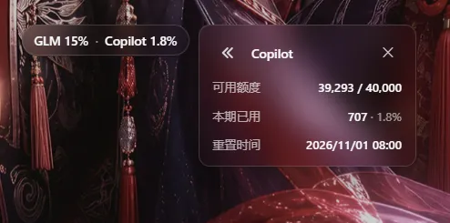
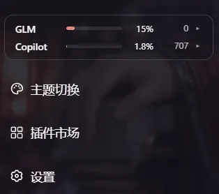

# dsh-quota-watch — DSH Web 额度监控

[](../../releases)
[](../../actions/workflows/ci.yml)
[](./LICENSE)
[](https://www.npmjs.com/package/@iasiv5/dsh-quota-watch)
[](#-兼容性)

[English summary](#english-summary) · 中文

在常驻悬浮胶囊里一眼看尽 GLM Coding Plan 与 GitHub Copilot 的额度快照。不统计 DSH 会话 token、不保存历史、也不需要在浏览器里输入任何 provider 密钥。



## ✨ 功能一览

- **🚀 悬浮胶囊（默认界面）**：一行「GLM 15% · Copilot 1.8%」常驻屏幕（默认右下角安全区），单击展开面板——胶囊上没有任何隐藏手势（右键 / 长按菜单已于 0.1.14 退役）。拖拽跟手（保持抓取点，transform 渲染）、任意位置停放、位置跨重启记忆、越界自动钳回视口（距边 8px 安全边距）；触摸设备直接拖拽（更宽的防误拖阈值）、点击热区 44px、自动避让 iPhone 刘海 / 小黑条（safe-area）。已用超过 80% 转橙、超过 95% 转红，任一 provider 超 95% 时轻微脉动（尊重系统「减少动态效果」设置）。悬停提示与 aria-label 实时给出摘要。
- **🖥️ 详情面板**：半透明毛玻璃底，宽 `min(320px, 100vw−24px)`，靠边自动翻侧，滚动 / 缩放跟随；≤480px 窄屏自动改为底部弹层并避开 safe-area；Esc 或点击面板外关闭。概览列两个 provider 行，点击进入详情：
  - **GLM**：今日 Tokens / 调用次数双大数字 + 五列对齐窗口网格（MCP（月）→ 5 小时 → 每月 → 每周固定排序，周窗口未下发时显示「每周额度 · ♾️（无限）」占位）+ 分模型用量行；
  - **Copilot**：可用额度、本期已用（credits 消耗 + 弱化百分比）、重置时间三行。
  - 窗口备注的括号按语言成对统一（zh 全角 `（…）` / en 半角 `(…)`），备注列左缘恒对齐（0.1.16）。接口未下发有效 `remaining` / `percent_remaining` 时该行不渲染，`credits_used` 绝不用于推算余额。
- **🎛️ 面板底部等宽双按钮**：「显示 / 隐藏侧边栏卡片」（文案随状态翻转）+「立即刷新」（触发宿主立即探测）。grid `1fr 1fr` 强制等宽，宽度与文案长度、界面语言无关；加载 / 出错空态下按钮同样在场；静息字样与行内弱化数值（如「3.8亿」）同字号同透明度，hover 恢复全强度。
- **🧩 侧边栏卡片（可选，默认隐藏）**：胶囊是默认界面；需要侧栏卡片时从面板底部按钮开启（Web profile 侧栏底部区块存在时才出现该按钮）。卡片提供摘要行 + 行点击开面板 + 行首 provider 名称点击立即探测。侧栏收起（Web 窄栏）或容器过窄（<160px，跨 profile 通用判据）时自动隐藏，侧栏整体不存在（Desktop 收起态）同样自然缺席、无报错——入口始终由悬浮胶囊承载。
- **🌏 语言跟随宿主**：界面文案跟随 DSH「设置 → 语言」——宿主 locale 特性把解析结果实时镜像到 `<html lang>`，插件监听该属性，切换即热重渲染（无需刷新页面）；宿主未同步时回退浏览器语言。
- **🛟 降级与容错**：凭据缺失的 provider 不渲染摘要行与胶囊分段（两者皆缺时悬浮胶囊与卡片一并隐藏）；探测失败时保留最后一次成功数据并在行上加 ⚠ 过期标记（⚠ 只出现在面板与卡片行内，不在胶囊上显示）。
- **🔁 刷新节奏**：宿主默认每 60 秒探测（窗口 + 用量 + Copilot），profile 可配 30–3600 秒；浏览器页签可见时每 30 秒刷新视图，隐藏时暂停。重启冷启动零等待：宿主 0 秒即发首轮探测（网络未就绪时以 5 秒冷重试直至拿到数据），客户端在无数据期间以 2 秒起步的指数退避快速重试、拿到数据后回到常规节奏——重启后数秒内胶囊即出现，不再有 ~30 秒空窗。所有 UI 收在 Shadow DOM 里（ADR 0001），颜色走 DSH 主题语义变量（含硬编码兜底），自动适配浅色 / 深色主题。

## 📸 界面巡礼

GLM 详情（双大数字 + 窗口网格 + 分模型用量）与 Copilot 详情（额度 / 已用 / 重置时间）：

| GLM 详情 | Copilot 详情 |
|---|---|
|  |  |

侧边栏卡片（可选开启，占侧栏 footer 第一槽位）：



## 🚀 安装

**方式一（推荐）· DSH 插件市场（dsh-m）**：打开 DSH 侧栏的「插件市场」，搜索 **Quota Watch**（或「额度」）一键安装——市场锁定精确版本、自动处理依赖，后续升级也在市场里完成。

**方式二 · 命令行**（无市场环境或脚本化装机）：

```sh
dsh plugin --profile web add @iasiv5/dsh-quota-watch      # web profile
dsh plugin --profile desktop add @iasiv5/dsh-quota-watch  # desktop profile
```

**web 与 desktop 两种 profile 均已适配**：悬浮胶囊在两端都是常驻入口；侧边栏卡片是渐进增强——只要侧栏底部区块存在即可从面板按钮开启，侧栏收起或不存在（Desktop 收起态）时自动缺席。插件管理器会应用包内 `cordis.patch.yml`；宿主半区的变更需要重启 DSH 后生效（web 重启 `dsh web` 服务，desktop 重启应用），客户端 bundle 随插件加载，装好后刷新页面，右下角即是额度胶囊。npm 发布新版本后，市场 / 镜像同步可能略有延迟，立即装不到最新版时稍候重试即可。禁用插件请使用 DSH 插件管理器。

## ⚙️ 配置

- **探测周期**：在 profile 的 `quota-watch` Cordis row 设置 `config.pollIntervalSec`（30–3600，默认 60）。
- **DSH 版本**：要求 `0.1.7-rc.2` 或更高；适配 `web` 与 `desktop` 两种 profile——Desktop 收起侧栏时由悬浮胶囊承载入口，卡片为 Web 渐进增强。

## 🔍 数据来源与语义

- **凭据链路**：GLM 从 `llm-pi-ai` profile 中配置的 provider `apiKeyEnv` credential reference 解析当前 key，支持 `zai-coding-cn`（国内）与 `zai` / `zai-coding`（国际）路由；每次探测都重新解析引用，用户轮换凭据后下一轮读取新值。Copilot 使用内置 `llm-pi-ai/github-copilot` OAuth grant 的 `payload.refresh` 访问配额快照——不使用给模型请求的短期 `payload.access`，也不使用 `COPILOT_GITHUB_TOKEN` 环境引用；每轮重新读取 grant，以支持重新授权或轮换。
- **GLM**：查询 `https://open.bigmodel.cn/api/monitor/usage/quota/limit` 或 `https://api.z.ai/api/monitor/usage/quota/limit`（窗口百分比），以及同域 `/api/monitor/usage/model-usage?startTime=…&endTime=…`（今日 tokens 与调用次数，时间格式 `yyyy-MM-dd HH:mm:ss`）。两个接口均按 raw API key 鉴权，不加 Bearer 前缀。
- **Copilot**：查询 `https://api.github.com/copilot_internal/user`。这是 GitHub Copilot 内部、非公开稳定契约的端点，字段可能变更；插件在无法确认额度含义时显示不可用，不猜测或计算余额。对企业 / 组织管理的 seat，GitHub AI Credits 可能属于共享计费池——侧栏呈现的是 GitHub 用户 quota snapshot 中的可用额度，不保证等同组织账单的总余额。
- **隐私**：凭据只在 DSH 宿主进程解析并用于 HTTPS 请求；浏览器只接收规范化后的额度字段。插件不把 key、OAuth grant 或原始 provider 响应写入磁盘，也不保存额度历史。

## 🔐 安全

- API 路由只允许 loopback 或已配对的浏览器访问；响应禁用缓存。
- 本仓库、测试 fixtures 与 npm 包不得包含任何真实 key、OAuth grant、临时 token、原始账号响应或个人余额。测试仅使用合成响应。
- npm 包采用显式 `files` 白名单；`npm run security:check` 会扫描工作树和实际 pack 文件，诊断只报告路径和规则名，不打印匹配值。
- 后续 tag release 使用 GitHub Actions OIDC 与 provenance，版本发布者身份为 GitHub Actions，不保存长期 npm token；源码和 npm tarball 不写入发布账号邮箱。

## English summary

DSH Quota Watch is a personal DSH quota monitor built around a persistent floating capsule: a one-line `GLM x% · Copilot y%` summary that turns amber past 80% and red past 95%. Dragging it is grab-accurate (transform-based, rAF-batched) and free to place anywhere on the screen, with position remembered across restarts and viewport boundaries automatically clamped. Touch devices drag directly (wider slop against accidental drags), the hit area is padded to 44px and placement respects `env(safe-area-inset-*)`. Clicking the capsule opens a floating glass panel whose overview reuses the classic 0.0.18 summary rows (label · bar · percent · extra · chevron) and whose detail pages replicate the 0.0.18 big numbers, window grid and per-model list; the panel closes via ✕, Esc or an outside click, and viewports ≤480px dock it to the bottom as a sheet. The panel footer holds two equal-width buttons — sidebar-card visibility and an immediate provider re-probe — replacing the retired right-click/long-press menu, so the capsule itself carries no hidden gestures. A sidebar card remains an opportunistic extra entry on web profiles, opted in from that footer button, and silently disappears whenever the sidebar does — collapsed web sidebars and the desktop profile are covered by the floating capsule alone. Credentials are resolved on every host-side probe, only normalized values reach the browser, no usage history is kept, and a Copilot balance is never inferred from credits used. UI copy follows the DSH language preference (mirrored live onto `<html lang>`, re-rendering on switch without a reload) and falls back to the browser language; window notes share one paren glyph per locale so the grid's left edges stay aligned. Colors ride DSH semantic theme tokens with hardcoded fallbacks; all UI lives inside a shadow root (ADR 0001).
